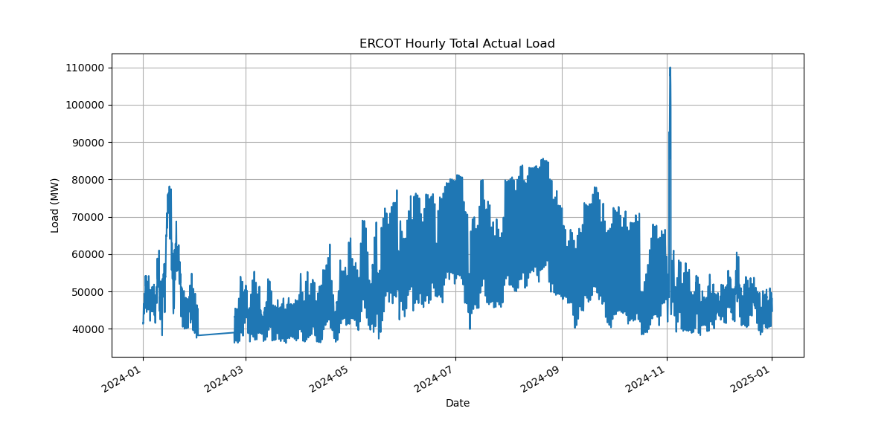
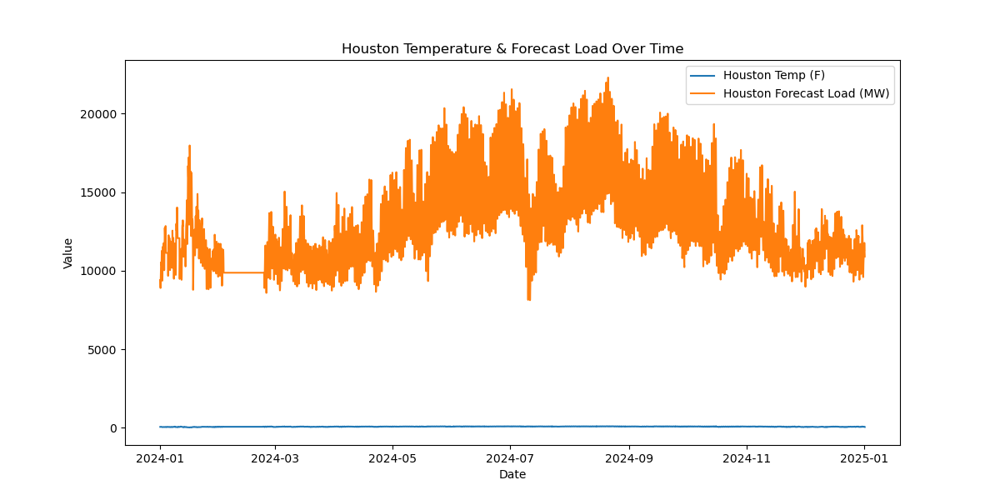

# ⚡ ERCOT Load Forecasting Project

## 📌 Project Overview

This project focuses on forecasting electricity demand in the ERCOT (Electric Reliability Council of Texas) region using historical load and weather data. The aim is to develop predictive models and visualize trends using an interactive dashboard.


## 📊 Data Sources

- **ERCOT Load Data**: Hourly actual and forecasted load data.
- **Weather Data**: Temperature data from:
  - Houston International Airport
  - Dallas/Fort Worth


## 🧹 Data Preprocessing

- Skipped metadata rows during import.
- Converted timestamp columns to datetime format.
- Interpolated temperature and load columns to handle missing values.
- Forward and backward filled missing values for forecast data.
- Set `UTC Timestamp` as the datetime index.
- Filtered and cleaned final dataset for modeling.


## 📈 Exploratory Data Analysis

- Visualized temperature and load trends over time.
- Identified hourly, daily, and seasonal patterns in electricity usage.
- Decomposed time series using `statsmodels` to analyze trend and seasonality components.


## 🤖 Forecasting Models

We used **Facebook Prophet** for time series forecasting:

- Trained on hourly `TOTAL Actual Load (MW)` values.
- Generated 7-day hourly forecasts.
- Visualized the forecast with confidence intervals.


## Visualizations

### ERCOT Hourly Total Actual Load


### Total Actual Load (MW)
.png)

### Houston Temperature & Forecasted Load Over Time



## 📌 Sample Code Snippet

```python
from prophet import Prophet

# Prepare data
df_prophet = df.reset_index()[['UTC Timestamp (Interval Ending)', 'TOTAL Actual Load (MW)']]
df_prophet.columns = ['ds', 'y']

# Train model
model = Prophet()
model.fit(df_prophet)

# Forecast next 7 days (hourly)
future = model.make_future_dataframe(periods=24 * 7, freq='H')
forecast = model.predict(future)

# Plot
model.plot(forecast)


## ✅ Conclusion

This project highlights the importance of integrating weather patterns into energy demand forecasting. Accurate forecasting can help grid operators, policymakers, and utilities plan ahead, minimize outages, and promote energy efficiency.


## 📁 Repository Structure

.
├── ercot_load-temp_hr_2024.csv
├── forecast_model.ipynb
├── plots/
│   ├── Houston_temperature_&_forecast_load_over_time.png
│   ├── ERCOT_hourly_total_actual_load.png
│   └── Total_actual_load(MW).png
├── README.md
```


## 👤 Author

**Chisom Mbah**  
📍 Data Science Portfolio Project  
🔗 [GitHub Profile](https://github.com/Emychisom)
